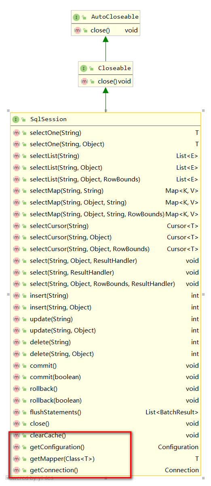

#### SqlSession,SqlSessionFactory介绍

SqlSession相当于Mybatis的门面类,对Connection对象做了一次包装,SqlSessionFactory从名字可以看出主要用于构建Sqlsession对象,由上图的UML图可知,SqlSession只有一个实现类DefaultSqlSession,SqlSessionFactory也只有一个实现类DefaultSqlSessionFactory。  ***SqlSessionManager***实现了两个接口,集成了对SqlSession的操作和创建SqlSeesion对象。

##### SqlSession 接口
Sqlsession接口声明了对数据库的基本操作,如下图

除了基本的CURD之外，该接口还声明了可用于获取当前配置对象和操作数据库的Mapper接口(类)以及当前的连接对象等操作。SqlSession默认的实现类Default则实现类相关的功能。

#### DefaultSqlSession实现类
#### 使用工厂模式和建造者模式进行构建
#### 浅谈SqlSesion下的工厂模式和建造者模式