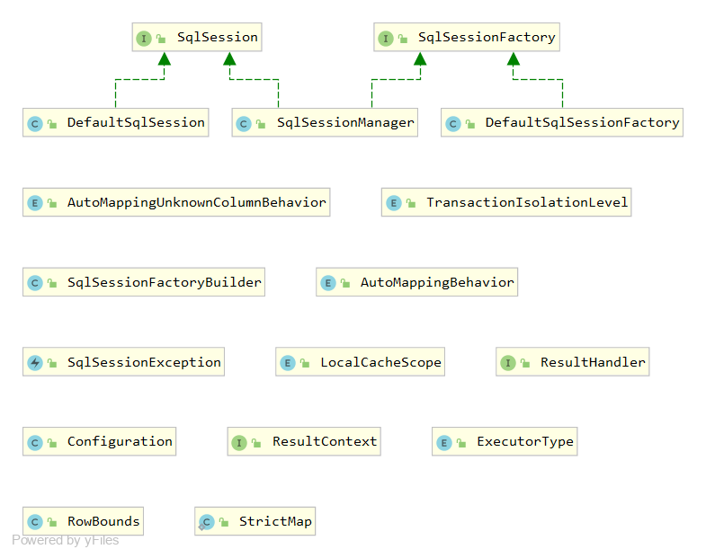

#### Session包下的类结构

- SqlSession接口:
- SqlSessionFactory接口:
- SqlSessionFactoryBuilder：
- 枚举类

|类名|默认值|重要程度|说明|
|--- |--- |---|---|
|TransactionIsolationLevel|NONE(Connection.TRANSACTION_NONE), READ_COMMITTED(Connection.TRANSACTION_READ_COMMITTED), READ_UNCOMMITTED(Connection.TRANSACTION_READ_UNCOMMITTED), REPEATABLE_READ(Connection.TRANSACTION_REPEATABLE_READ), SERIALIZABLE(Connection.TRANSACTION_SERIALIZABLE);|||
|AutoMappingBehavior|NONE,PARTIAL,FULL||
|LocalCacheScope|SESSION,STATEMENT||
|ExecutorType|SIMPLE, REUSE, BATCH||

